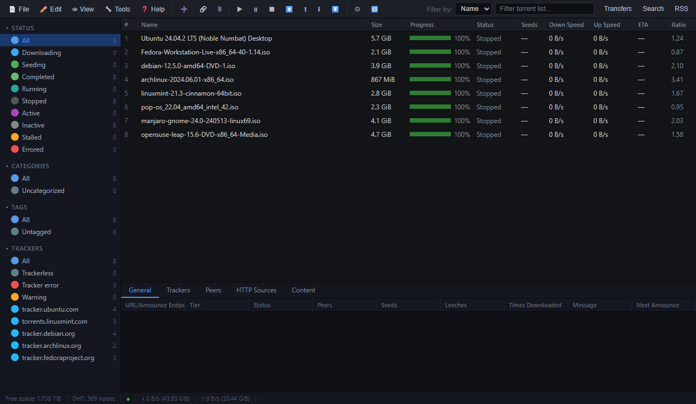
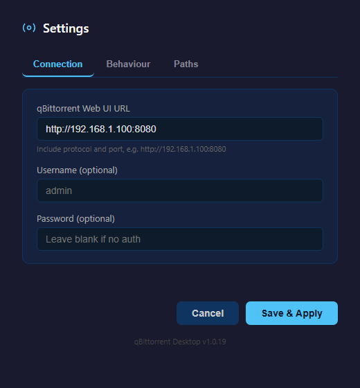
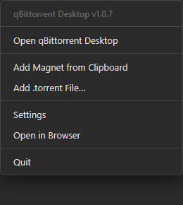

# qBittorrent Desktop

<p align="center">
  <a href="https://github.com/GeorgeAL78/qbittorrent-desktop/actions/workflows/release.yml"></a>
  <a href="LICENSE"></a>
  
  
</p>

<p align="center">
  <a href="https://github.com/GeorgeAL78/qbittorrent-desktop/releases/latest"></a>
  
  <a href="https://github.com/GeorgeAL78/qbittorrent-desktop/releases"></a>
  
  
</p>

<p align="center">
  <a href="https://github.com/GeorgeAL78/qbittorrent-desktop/issues"></a>
  
  
  
</p>

<p align="center">
  <a href="#features">Features</a> •
  <a href="#how-it-works">How it works</a> •
  <a href="#screenshots">Screenshots</a> •
  <a href="https://github.com/GeorgeAL78/qbittorrent-desktop/releases/latest"><b>Download</b></a> •
  <a href="#setup">Setup</a> •
  <a href="#build">Build</a> •
  <a href="#components">Components</a> •
  <a href="#settings">Settings</a> •
  <a href="#changelog">Changelog</a> •
  <a href="#license">License</a>
</p>

A Windows 11 desktop client for qBittorrent running on a remote machine or Docker container. Wraps the qBittorrent Web UI in a native Electron app with added desktop integrations.

> 🐳 **Integrates with [pia-qbittorrent-docker](https://github.com/GeorgeAL78/pia-qbittorrent-docker)** — a Docker stack that runs qBittorrent behind a PIA VPN. When connected to it, the title bar shows the running **container version**. The Docker stack is optional, though — this app works with **any** qBittorrent Web UI (local, remote, or NAS).

## Features

- **Full qBittorrent Web UI** — 100% feature parity, running inside a native window
- **Magnet link handler** — register as the default `magnet:` handler so clicking a magnet link in any browser opens the app with an add-confirmation popup
- **Clipboard monitor** — automatically detects magnet links copied to clipboard and offers to add them
- **System tray** — minimize to tray, optionally start minimized, or launch automatically at Windows startup
- **Automatic updates** — the installed app checks GitHub Releases on launch and updates itself in the background
- **Completion notifications** — desktop popup when a torrent finishes downloading
- **Double-click to open** — double-click a torrent in the transfer list to open its download folder, or double-click a file/folder in the Content tab to open it directly
- **Path mapping** — maps remote server paths to local mounted paths (e.g. `/downloads` → `Z:\qbittorrent`)
- **.torrent file association** — open .torrent files directly with the app

## Components

<!-- COMPONENTS:START (auto-generated by scripts/update-components.js — do not edit by hand) -->
| Component | Version |
|---|---|
| Electron | 42.5.0 |
| Chromium | 148.0.7778.271 |
| Node.js (bundled) | 24.17.0 |
| V8 | 14.8.178.33 |
| electron-builder | 26.15.3 |
| electron-updater | 6.8.9 |
<!-- COMPONENTS:END -->

## Screenshots

| Main Window | Settings | Tray Menu |
|---|---|---|
|  |  |  |

## How it works

### Native window around the Web UI
qBittorrent Desktop loads your qBittorrent **Web UI** inside a native window (Electron/Chromium), so you get the full, familiar qBittorrent interface — every tab, column, and setting — without keeping a browser tab open. It communicates over qBittorrent's Web API, so it works with **any** reachable instance (local, remote server, NAS, or Docker). Everything below is added on top of that web interface.

### Magnet links from your browser
When the handler is enabled, the app registers itself with Windows as the opener for `magnet:` links. Click a magnet on any site and a small confirmation popup appears in the corner showing the torrent's name, with **Add to qBittorrent** / **Dismiss** (it auto-dismisses after ~12 seconds). To make it the default opener, set it once in **Settings → Apps → Default apps → Choose defaults by link type → `MAGNET`**. See [Settings](#settings) to toggle the registration.

### Clipboard monitoring
With *Monitor clipboard for magnet links* enabled, the app watches your clipboard and shows the same add-confirmation popup whenever you copy a magnet link — useful for sites that expose the magnet as plain text rather than a real `magnet:` anchor.

### System tray & startup
Closing the window keeps the app running in the system tray (toggleable). The tray menu lets you re-open the app, add a magnet from the clipboard, add a `.torrent` file, open Settings, check for updates, or open the Web UI in your browser. It can also **start minimized** and **launch automatically at Windows login** (minimized to tray) so it's always running in the background.

### Automatic updates
The installed app checks GitHub Releases on launch and periodically afterward, downloads new versions in the background, and surfaces a **⟳ Restart to Install Update** entry in the tray when one is ready. Updates install silently and the app relaunches itself. (The portable build doesn't self-update — only the installer version does.)

### Open files & folders locally (path mapping)
qBittorrent refers to files using **its own** paths (e.g. `/downloads` inside a Docker container), which don't exist as-is on your Windows PC. **Path mapping** bridges that: you tell the app the remote base path and where it's mounted locally (e.g. `/downloads` → `Z:\qbittorrent`). Once set:
- **Double-click a torrent** in the transfer list → opens its download folder in Explorer.
- **Double-click a file or folder** in the **Content** tab → opens that exact file in its default app, or that folder in Explorer.

### Completion notifications
When a torrent finishes downloading, you get a native Windows notification; clicking it brings the app to the front.

### .torrent file association
The app registers as a handler for `.torrent` files, so double-clicking a downloaded `.torrent` adds it straight to qBittorrent (you can also use **Add .torrent File…** from the tray).

## Requirements

- qBittorrent running with Web UI enabled (local or remote/Docker)

> **To build from source** (optional): [Node.js](https://nodejs.org/) v18+ is required. The pre-built `.exe` files in Releases are fully self-contained — no Node.js needed to run them.

## Setup

```bash
git clone https://github.com/GeorgeAL78/qbittorrent-desktop.git
cd qbittorrent-desktop
npm install
npm start
```

On first launch, a Settings window will open. Enter your qBittorrent Web UI URL (e.g. `http://192.168.1.169:8888`), credentials if required, and configure the path mapping.

## Build

Produces an NSIS installer and a portable `.exe` in `dist/`:

```bash
npm run build
```

## Settings

| Setting | Description |
|---|---|
| Web UI URL | Full URL to your qBittorrent Web UI including port |
| Username / Password | Leave blank if authentication is disabled |
| Run at Windows startup | Launch the app automatically on login (minimized to tray) |
| Start minimized | Launch directly to the system tray |
| Minimize to tray on close | Keep running in background when window is closed |
| Clipboard monitor | Watch clipboard for magnet links |
| Register as default magnet link handler | Register the app as the OS handler for `magnet:` links |
| Remote download path | The save path as qBittorrent sees it (e.g. `/downloads`) |
| Local path | Where that path is mounted on this PC (e.g. `Z:\qbittorrent`) |

## Changelog

### v1.0.25 *(latest)*
- Added a **Desktop** menu to qBittorrent's menu bar (Settings, Check for Updates, Open in Browser)

### v1.0.24
- The title bar now shows the qBittorrent **Docker image version** when the server advertises it (via an `X-Docker-Version` response header — supported by `pia-qbittorrent-docker`)

### v1.0.23
- Fixed completion notifications re-firing for every downloaded torrent whenever the qBittorrent server restarts (e.g. a Docker container reboot) — each torrent is now only notified once

### v1.0.22
- Updated Electron to 42.5.0 (Chromium 148, Node 24) — latest security/patch release

### v1.0.21
- Auto-updates now install silently — the installer/license page no longer interrupts the update (it still shows on a normal first install). Fixes the clunky update flow introduced when the license page was added in v1.0.16.

### v1.0.20
- Content tab: double-click a file to open it with its default app, or double-click a folder to open it in Explorer

### v1.0.19
- Settings window is now tabbed (Connection / Behaviour / Paths) — fits cleanly without scrolling or clipping

### v1.0.18
- Fixed the magnet-detected popup clipping its buttons when the torrent name is long (popup now sizes to the window correctly)

### v1.0.17
- Updated Electron from 40 to 42 (Chromium 148, Node 24) — latest security and rendering-engine fixes

### v1.0.16
- Installer now shows the GPL-3.0 license agreement with an "I Agree" step

### v1.0.15
- Added a small app-version badge in the bottom-left corner of the main window

### v1.0.14
- **Automatic updates** — the installed app now checks GitHub Releases on launch and updates itself in the background (tray menu shows "Restart to Install Update" when ready). Adds a "Check for Updates" item to the tray menu. Existing users need to install this version manually once; updates are automatic from here on. (Installed version only — the portable build does not self-update.)

### v1.0.13
- Updated Electron from 36 to 40, clearing 17 security advisories (including Windows-relevant `setAsDefaultProtocolClient` and `setLoginItemSettings` fixes)

### v1.0.12
- Fixed magnet links not opening from Chromium browsers (Edge/Chrome). The installer now registers the app's **Capabilities** so it appears in Windows *Default apps → Choose defaults by link type → magnet*. Set it there once and browsers will route magnet links to the app. (Installer is now per-machine so it can write the system-wide association.)

### v1.0.11
- Added `magnet:` protocol registration to the NSIS installer (necessary but not sufficient on its own — see v1.0.12)

### v1.0.10
- Added option to register/unregister the app as the default magnet link handler (Settings → Behaviour)

### v1.0.9
- Clicking a magnet link now shows the popup instead of silently adding

### v1.0.8
- Added screenshots to README (main window, settings, tray menu)

### v1.0.5
- Version number now shown in tray right-click menu
- Version number now shown at the bottom of the Settings window

### v1.0.4
- Settings window now opens automatically on first launch when no URL is configured
- Fixed crash when URL is empty (clipboard monitor, completion checker)
- "Start minimized" is now greyed out when "Run at Windows startup" is enabled

### v1.0.3
- Removed hardcoded personal IP from default config

### v1.0.2
- Added **Run at Windows startup** option — launches minimized to tray on login

### v1.0.1
- Fixed notification header showing `electron.app.qBittorrent Desktop`

### v1.0.0
- Initial release

## License

[GPL-3.0-or-later](LICENSE) — see the LICENSE file for the full text.
